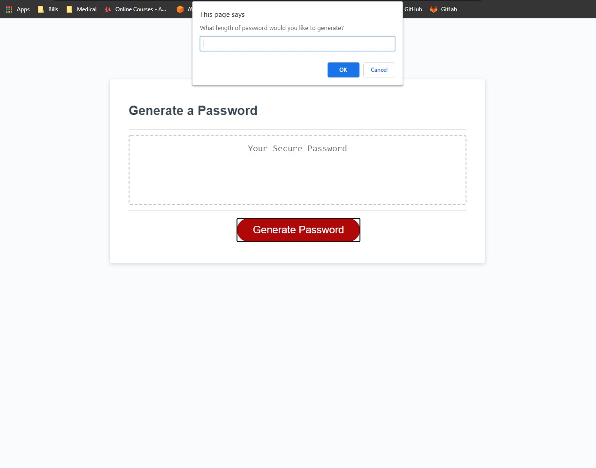
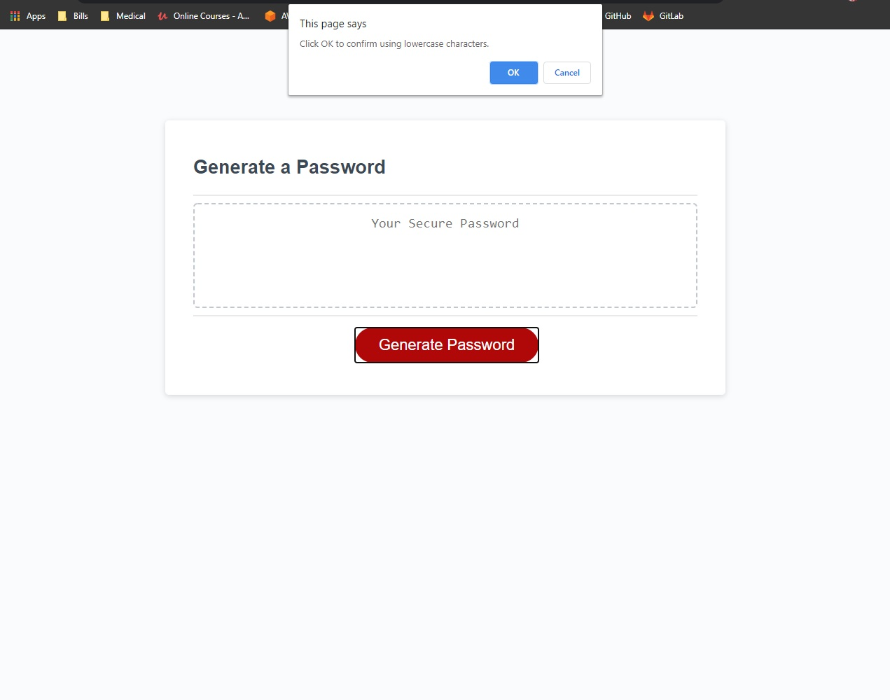
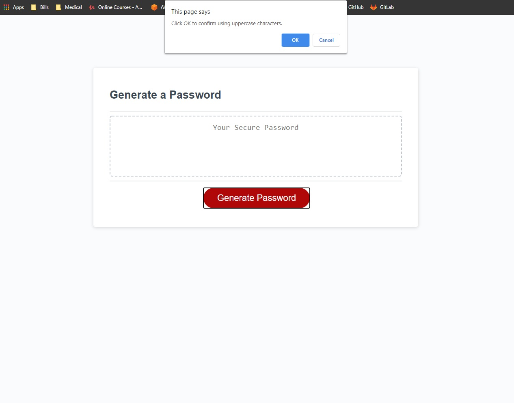
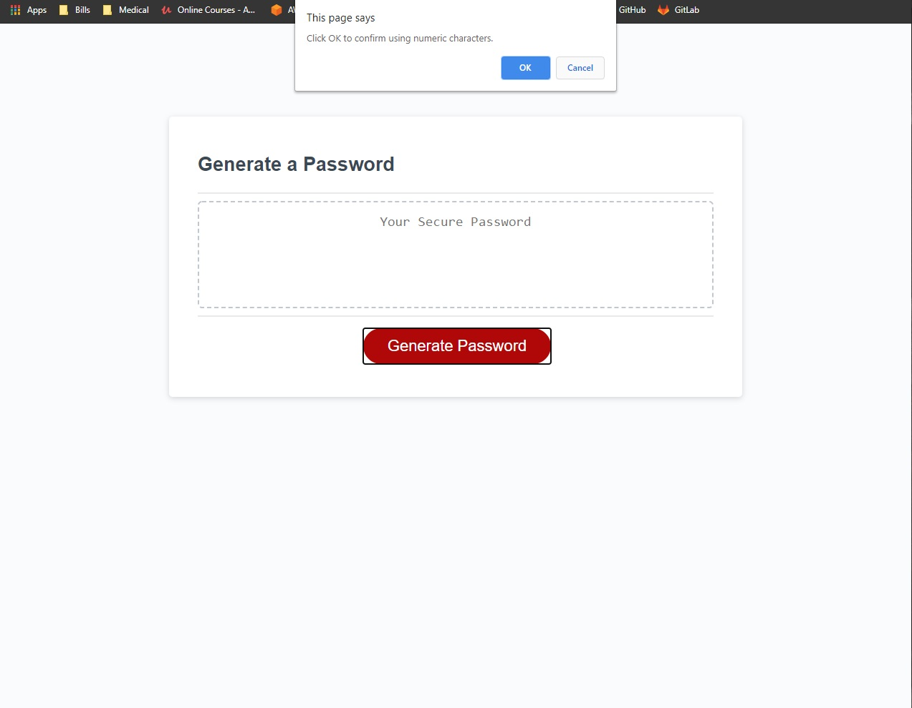
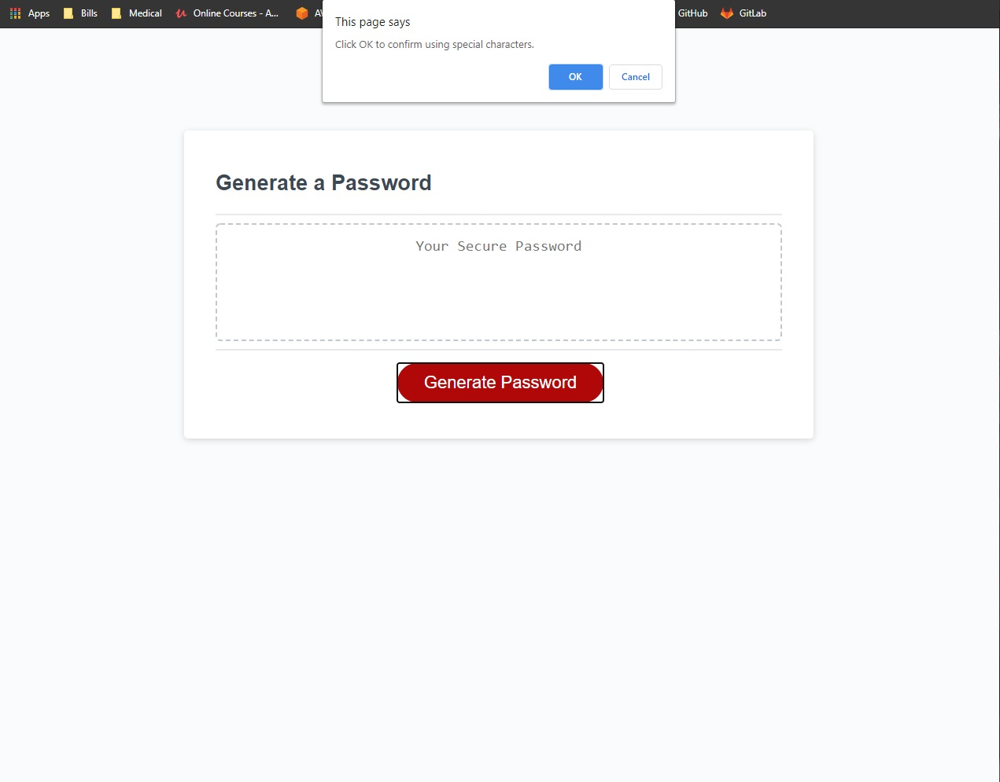
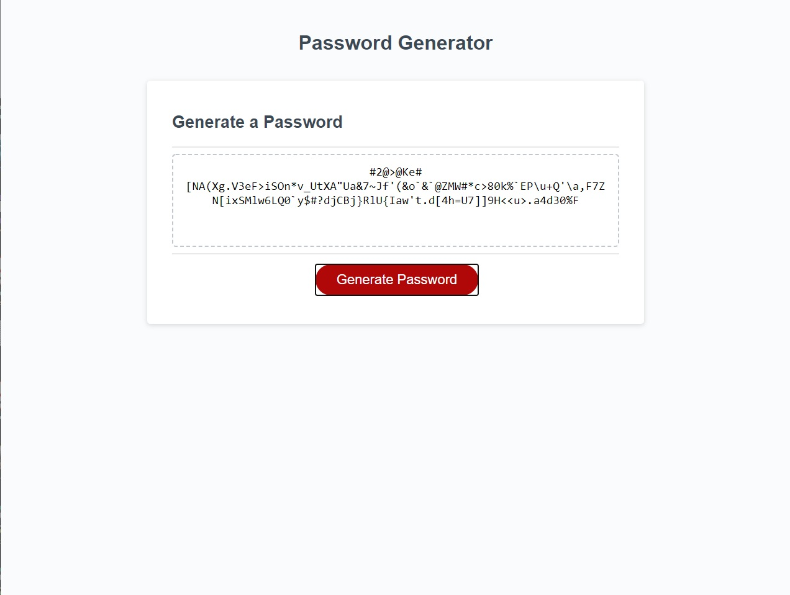

# random-password-generator

## Description

This web application allows for the generation of a random password based on criteria options selected by the user. The application runs in the browser and features dynamically updated HTML and CSS powered by JavaScript.

## Table of Contents

- [User Story](#user-story)
- [Acceptance Criteria](#acceptance-criteria)
- [Installation](#installation)
- [Application Screenshot](#application-screenshot)
- [Installation](#installation)
- [Usage](#usage)
- [Credits](#credits)

## User Story

```
AS AN employee with access to sensitive data
I WANT to randomly generate a password that meets certain criteria
SO THAT I can create a strong password that provides greater security
```

## Acceptance Criteria

```
GIVEN I need a new, secure password
WHEN I click the button to generate a password
THEN I am presented with a series of prompts for password criteria
WHEN prompted for password criteria
THEN I select which criteria to include in the password
WHEN prompted for the length of the password
THEN I choose a length of at least 8 characters and no more than 128 characters
WHEN prompted for character types to include in the password
THEN I choose lowercase, uppercase, numeric, and/or special characters
WHEN I answer each prompt
THEN my input should be validated and at least one character type should be selected
WHEN all prompts are answered
THEN a password is generated that matches the selected criteria
WHEN the password is generated
THEN the password is either displayed in an alert or written to the page
```

## Installation

In order to view this application, please visit the main page https://ntch2000.github.io/random-password-generator/.

To see the code base for this page, visit my github page https://github.com/ntch2000/random-password-generator. The code can be viewed directly in the github repository or downloaded and viewed in Visual Studio Code.

## Application Screenshots


_Sample application screenshot of password length user prompt._


_Sample application screenshot of confirm message for using lowercase characters._


_Sample application screenshot of confirm message for using uppercase characters._


_Sample application screenshot of confirm message for using numeric characters._


_Sample application screenshot of confirm message for using special characters._


_Sample application screenshot of a 128 character password, using all character types (lowercase, uppercase, numeric, and special characters)._

## Usage

This application can be used to generate a random password between 8 and 128 characters long. This password will use a combination of lowercase, uppercase, numeric, and special characters based on the input from the user.

When the 'Generate Password' button is pressed, the application will prompt the user to enter the desired length of password, and will follow with prompts for each type of character to be used. After the user enters their inputs, a password will randomly be generated and output to the application page, meeting the requirements specified.

The following series of events will occur:

1. Users will be prompted for a password greater than 8 and less than 129 characters in length.
2. Users will be asked to confirm at least one type of character to be used in the password based on the following:

   - Lowercase characters
   - Uppercase characters
   - Numeric characters
   - Special characters

3. Password will be generated based on the choices from the previous steps.

## Development Challenges

One of the first major challenges for this application was the input validation for the types of characters to be used in the password. Because at least one type of character needed to be used, a boolean value was used in a conditional statement to check for the use of each character type. If any one of the boolean values were true, the code would continue and another variable (characterChoice) was set to true indicating that an available set of characters could be used. This logic was nested within a while loop that would continue until a valid choice was made.

The second major challenge was creating the overall character string (passwordCharSet) to be used to create the password. The best way to accomplish this was to check if the user selected a character set with a boolean variable and add the corresponding character string to passwordCharSet. If the boolean was false, this meant the user did not want to use that particular type of character and the set would not be added.

Ensuring error checking edge cases were accounted for was another difficult task that required utilizing MDN Web Docs to find functions and methods to check for the data type for the user's input. Since the prompt() function returns a string, there needed to be a check to ensure the input was a number and not a word. To accomplish this, isNaN() was used. This function returns a boolean value if the variable is a number, even if the data type is a string number. Once this was verified, there needed to be a way of checking if the input was an integer. To do this, the Number.isInteger() method. This method checks to ensure the passwordLength variable is a whole number. In order for this to work, the variable needs to be a number and not a string. The easiest way to accomplish this was to use the unary operator (+), which converts the variable to a positive number.

Finally, the application needed a way to cancel out of the application. This was done by checking if the user clicked the cancel button when prompted for password length. If the password length returned null, or no input, the function returns a cancel message to the screen.

## Credits

Resources used to help develop this application are as follows.

- The [Mozilla MDN Web Docs](https://developer.mozilla.org/en-US/docs/Web/JavaScript) website was used to reference JavaScript information to accomplish data and user input validation for the application.

---

© 2020 Neil Gandhi
